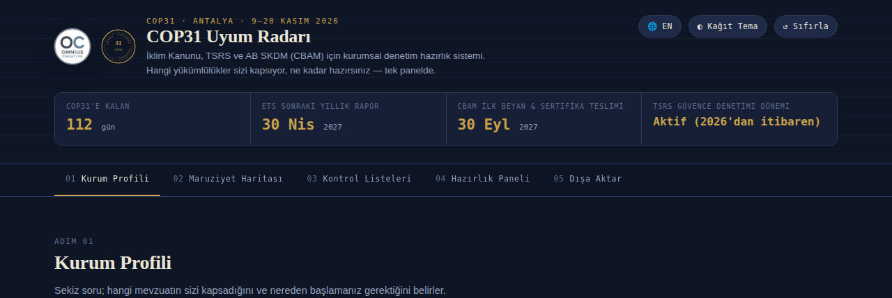
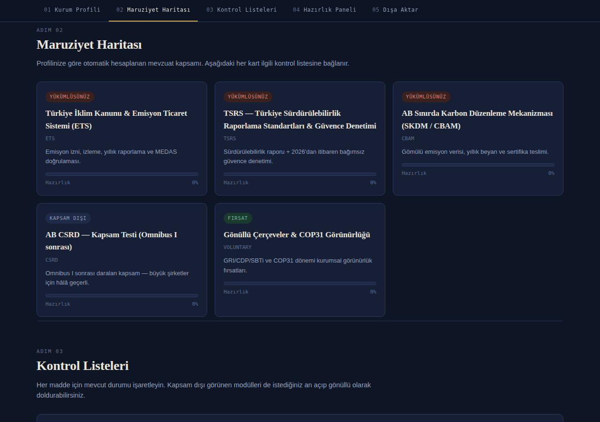
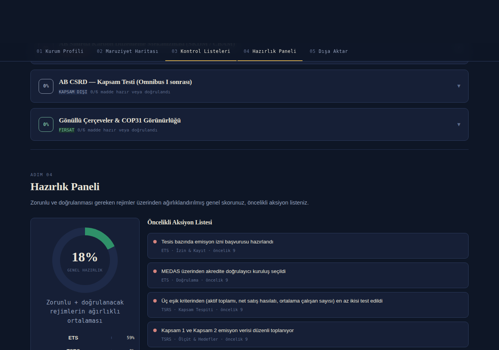
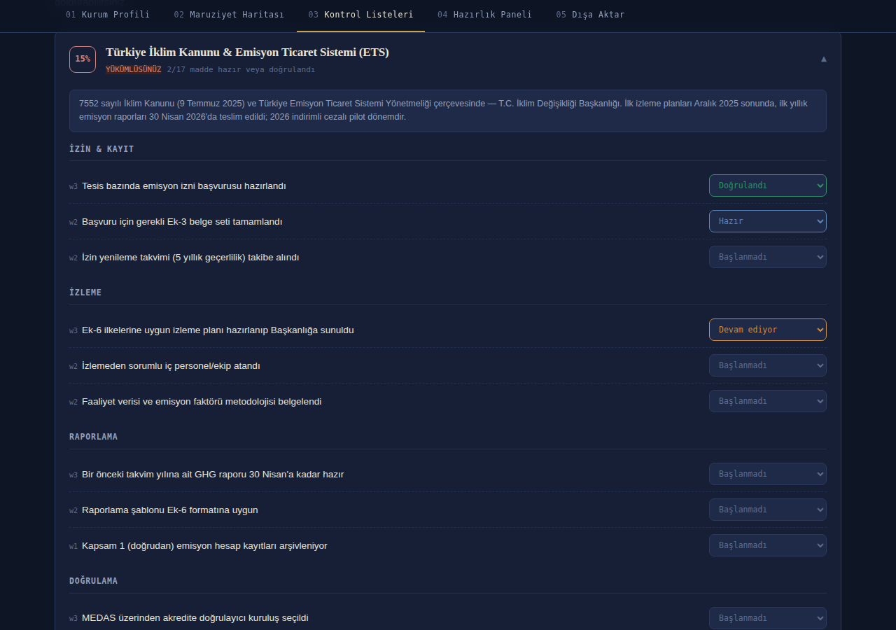

# COP31 Uyum Radarı
### Compliance Radar

**Türkiye İklim Kanunu (ETS) · TSRS · AB SKDM (CBAM) için ücretsiz, interaktif hazırlık aracı**
**A free, interactive readiness tool for the Turkish Climate Law (ETS), TSRS, and EU CBAM**

[Türkçe](#-türkçe) · [English](#-english) — (https://burakdelibacak.github.io/cop31-uyum-radari/)

 

---

## 🇹🇷 Türkçe

### Nedir?

COP31, Türkiye'nin ev sahipliğinde **9–20 Kasım 2026**'da Antalya'da yapılıyor — tam olarak Türk şirketlerini
doğrudan etkileyen üç ayrı mevzuatın (İklim Kanunu/ETS, TSRS güvence denetimi, AB SKDM/CBAM) yürürlüğe girdiği
döneme denk geliyor. **COP31 Uyum Radarı**, bir şirketin bu rejimlerden hangileriyle muhatap olduğunu birkaç
soruyla otomatik tespit eden, her biri için ayrıntılı bir kontrol listesi sunan ve yönetim kuruluna
gösterilebilecek bir hazırlık raporu üreten ücretsiz bir öz-değerlendirme aracıdır.

### Özellikler

- **Otomatik maruziyet haritası** — 8 soru, 5 rejim (İklim Kanunu/ETS, TSRS, SKDM/CBAM, AB CSRD, gönüllü çerçeveler)
- **55 maddelik ağırlıklı kontrol listesi**, kategori bazlı ilerleme takibi
- **Hazırlık paneli** — ağırlıklandırılmış skor, öncelik sıralı aksiyon listesi
- **Tek tıkla PDF indirme** — sertifika ve tam denetim raporu (tarayıcı yazdırma penceresi gerekmez)
- **CSV dışa aktarma**
- **Türkçe / İngilizce** arayüz, koyu / kağıt tema
- **Tamamen çevrimdışı çalışır** — tek bir HTML dosyası, kurulum yok, sunucu yok, veri hiçbir yere gönderilmez;
  tüm veriler yalnızca kendi tarayıcınızda (localStorage) saklanır

<table>
<tr>
<td width="50%"></td>
<td width="50%"></td>
</tr>
<tr>
<td align="center">Maruziyet Haritası — hangi rejimler sizi kapsıyor</td>
<td align="center">Hazırlık Paneli — ağırlıklı skor ve aksiyon listesi</td>
</tr>
</table>

### Nasıl kullanılır?

1. [`cop31-uyum-radari.html`](index.html) dosyasını indirin
2. Herhangi bir tarayıcıda (Chrome, Edge, Safari, Firefox) çift tıklayarak açın — kuruluma gerek yok
3. Kurum profilinizi doldurun, ilgili modülleri işaretleyin, hazırlık raporunuzu indirin

Kurumsal kullanım için bu depodaki dosyayı kendi web sitenizde veya GitHub Pages üzerinden barındırabilirsiniz.

### Yasal Uyarı

Bu araç yalnızca kurum içi öz-değerlendirme ve hazırlık planlaması amacıyla hazırlanmıştır; hukuki, mali veya
denetim görüşü niteliği taşımaz ve resmî bir uygunluk beyanı ya da güvence denetimi yerine geçmez. Eşik
değerleri, kapsam listeleri ve tarihler ilgili mevzuatın güncellenmesiyle değişebilir — nihai karar öncesi
ilgili resmî kurumun güncel metnini doğrulayın.

**Resmî kaynaklar:** [UNFCCC COP31](https://cop31.tr) · [İklim Değişikliği Başkanlığı](https://iklim.gov.tr) ·
[KGK — TSRS](https://www.kgk.gov.tr) · [Ticaret Bakanlığı — SKDM](https://ticaret.gov.tr) ·
[European Commission — CBAM](https://taxation-customs.ec.europa.eu/carbon-border-adjustment-mechanism_en)

### Lisans

[Creative Commons BY-NC 4.0](https://creativecommons.org/licenses/by-nc/4.0/deed.tr) — ücretsiz kullanabilir,
kopyalayabilir ve paylaşabilirsiniz; **Omnius Creative'e atıf yapılması** ve **ticari amaçla satılmaması**
şartıyla. Ayrıntılar için [`LICENSE`](./LICENSE) dosyasına bakın.

### İletişim

**Omnius Creative** · İzmir, Türkiye
burakdelibacak@omniuscreative.com · https://omniuscreative.com/

---

## 🇬🇧 English

### What is this?

COP31, hosted by Türkiye, takes place in Antalya on **9–20 November 2026** — the exact window in which three
regulatory regimes affecting Turkish companies come into force: the Turkish Climate Law (ETS), TSRS assurance
audits, and the EU Carbon Border Adjustment Mechanism (CBAM/SKDM). **COP31 Compliance Radar** is a free
self-assessment tool that automatically determines which of these regimes apply to a given company, provides
a detailed checklist for each, and generates a board-ready readiness report.

### Features

- **Automatic exposure map** — 8 questions, 5 regimes (Climate Law/ETS, TSRS, CBAM, EU CSRD, voluntary frameworks)
- **55-item weighted checklist** with category-level progress tracking
- **Readiness dashboard** — weighted score, prioritised action list
- **One-click PDF export** — certificate and full audit report (no print dialog required)
- **CSV export**
- **Turkish / English** interface, dark / paper theme
- **Fully offline** — a single HTML file, no install, no server, no data ever leaves your browser
  (everything is stored locally via localStorage)

<table>
<tr>
<td width="50%"></td>
<td width="50%"></td>
</tr>
<tr>
<td align="center">Weighted checklist, category by category</td>
<td align="center">Readiness dashboard — weighted score and action list</td>
</tr>
</table>

### How to use

1. Download [`cop31-uyum-radari.html`](./cop31-uyum-radari.html)
2. Double-click to open in any browser (Chrome, Edge, Safari, Firefox) — no installation needed
3. Fill in your company profile, work through the relevant modules, download your readiness report

For institutional use, you're welcome to host this file on your own website or via GitHub Pages.

### Disclaimer

This tool is provided solely for internal self-assessment and readiness planning; it does not constitute
legal, financial, or audit opinion and is not a substitute for a formal compliance statement or assurance
audit. Thresholds, scope lists, and dates may change as the underlying legislation is updated — verify
against the relevant official authority's current text before making final decisions.

**Official sources:** [UNFCCC COP31](https://cop31.tr) · [Turkish Presidency of Climate Change](https://iklim.gov.tr) ·
[KGK — TSRS](https://www.kgk.gov.tr) · [Turkish Ministry of Trade — CBAM](https://ticaret.gov.tr) ·
[European Commission — CBAM](https://taxation-customs.ec.europa.eu/carbon-border-adjustment-mechanism_en)

### License

[Creative Commons BY-NC 4.0](https://creativecommons.org/licenses/by-nc/4.0/) — free to use, copy, and share,
provided you **credit Omnius Creative** and **do not sell it commercially**. See [`LICENSE`](./LICENSE) for details.

### Contact

**Omnius Creative** · İzmir, Türkiye
burakdelibacak@omniuscreative.com · https://omniuscreative.com/
